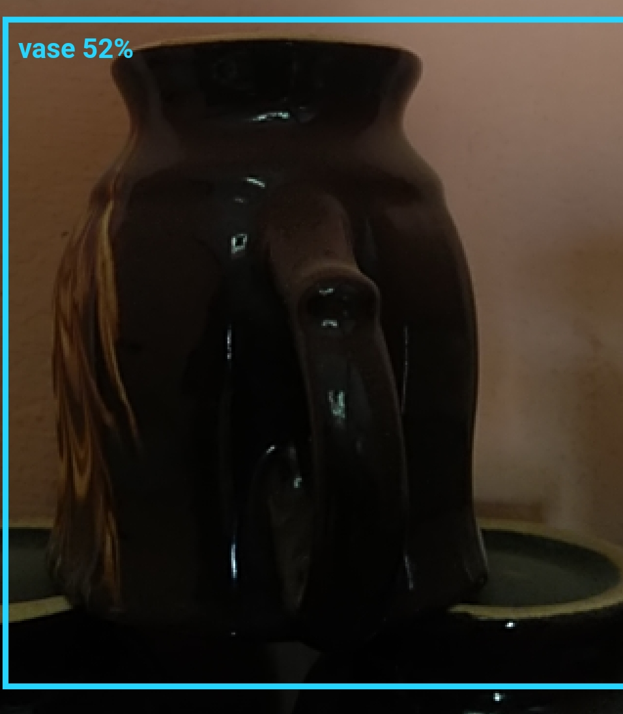
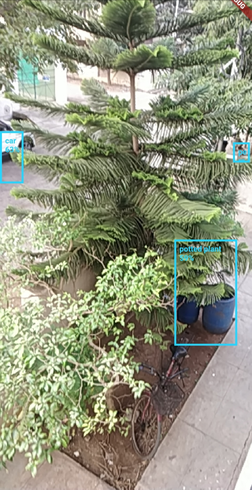
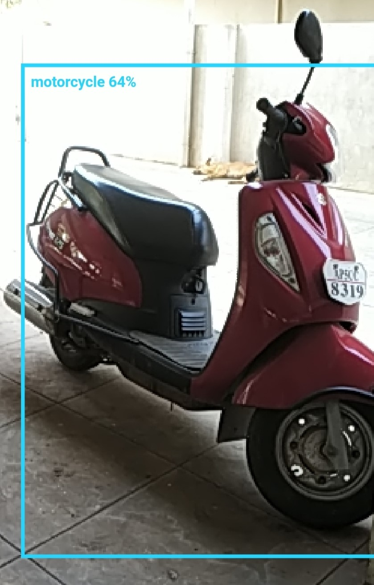
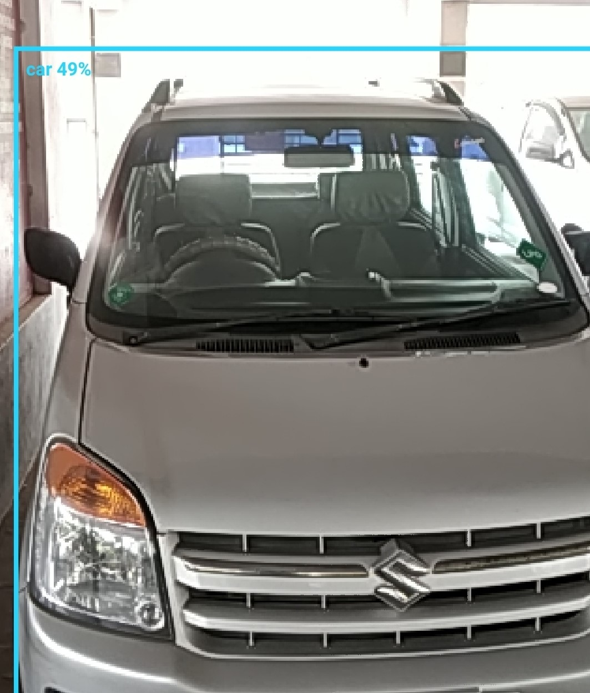
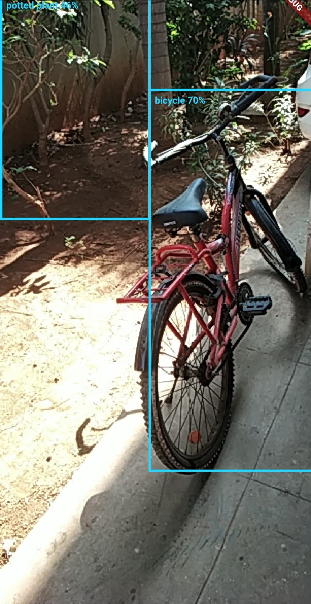
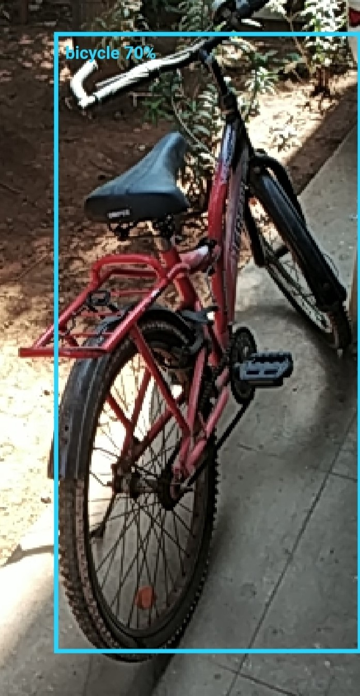
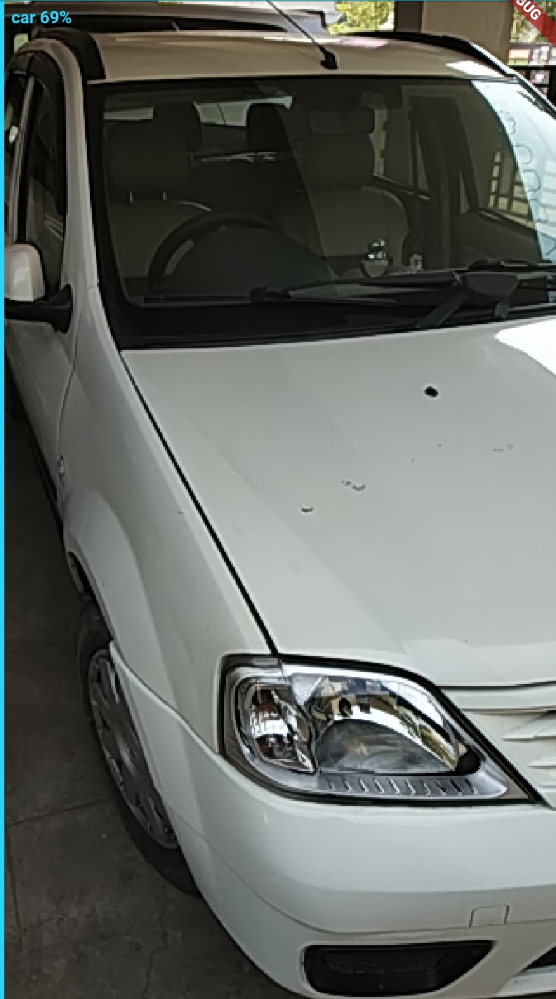
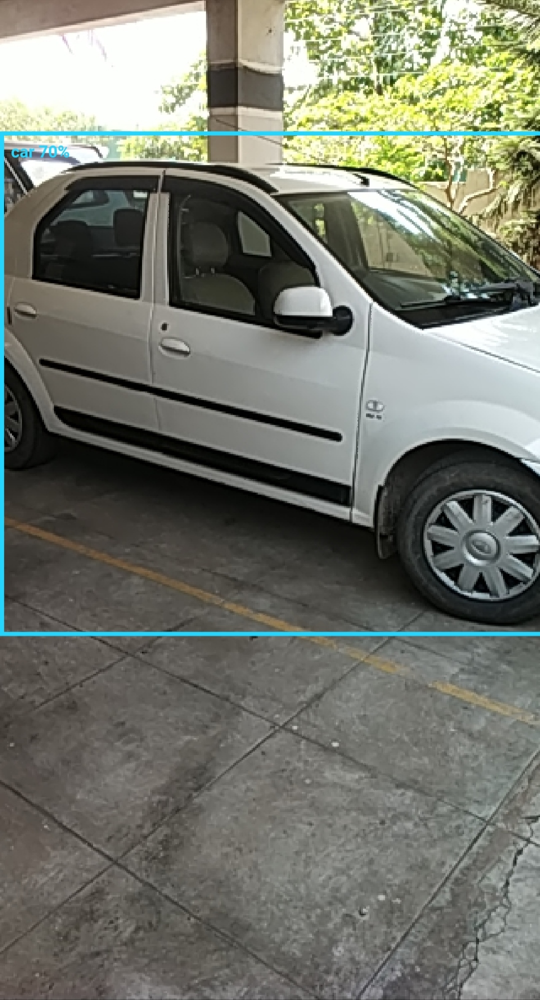
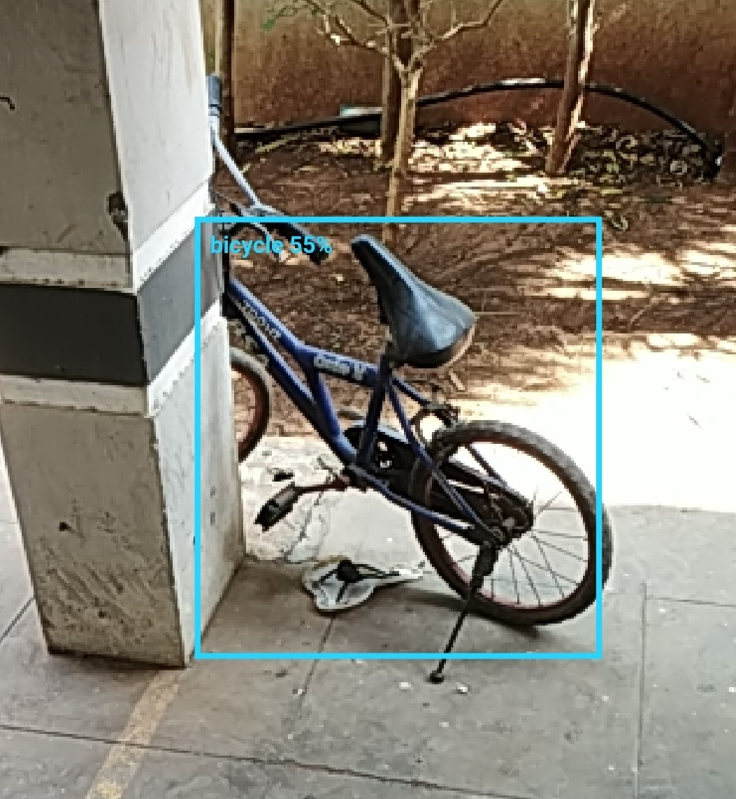
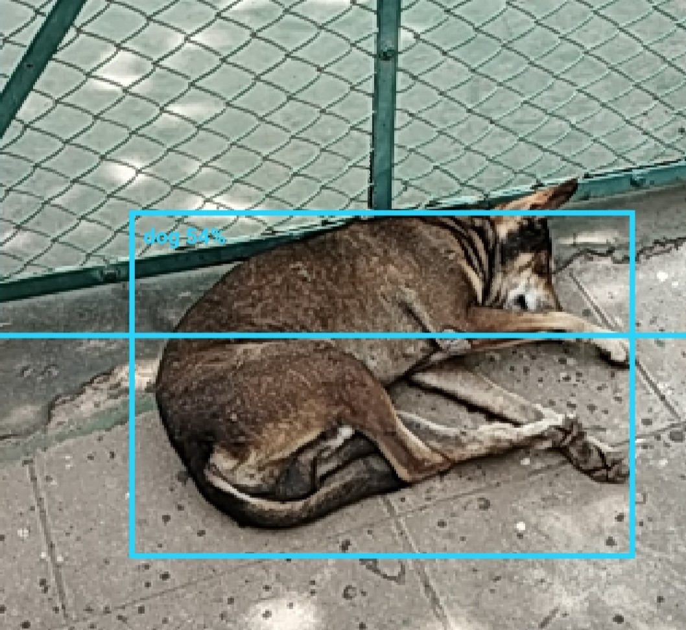

# Flutter Space

An App for Blind People which can speak whatever the object is in front of them.

## Features

<ul><li>Detection of Object </li></ul>
<ul><li>Speak the Object Name if Confidence in Class is greater than 50 </li></ul>

## Screenshots

## Feel like Contributing to the Project?

Contributions are Welcome! However, if it's going to be a major change, please create an issue first. Before starting to work 
on something, please comment on a specific issue and say you'd like to work on it.

